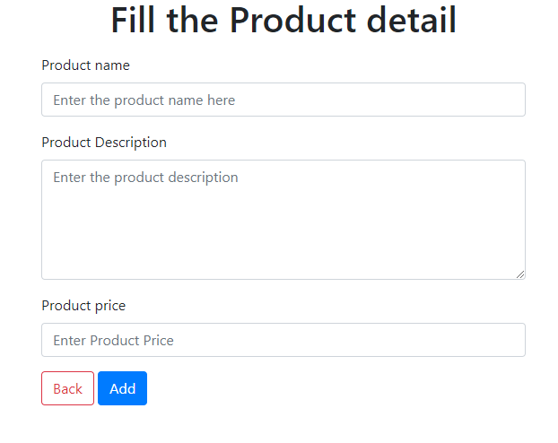

# Product_Application
## Tecnology used:
Java 
J2EE 
Spring Framework 
Database(Mysql)  
Javascript 
Html 

My Application is simple application in which we can able to do all CRUD operation.
## These is what my application look like

